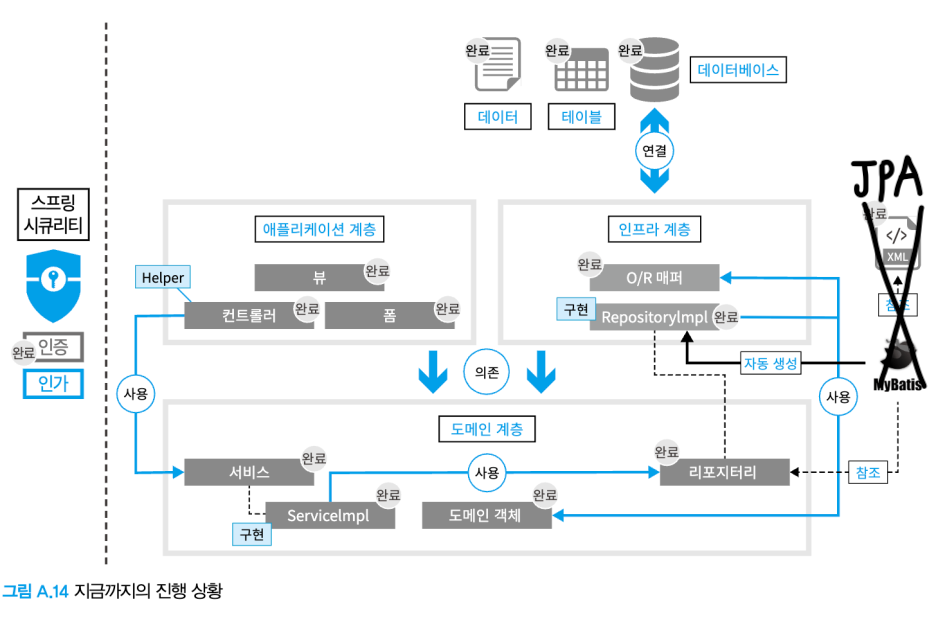
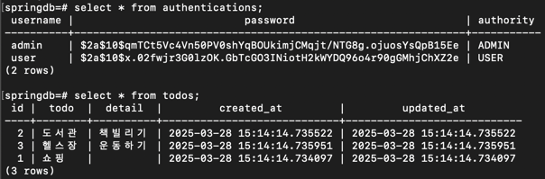

# Todo 웹앱
[스프링 프레임워크 첫걸음](https://ebook-product.kyobobook.co.kr/dig/epd/ebook/E000011146878) 책을 읽고 10-15장에서 만든 웹앱 입니다.

## 사용한 기술
- Spring Framework 6.2.5
- Spring Boot 3.4.4
- Spring Security 6.4.4
- Spring Data JPA (JPQL)
- Thymeleaf
- Lombok
- PostgreSQL (+ pgadmin 4)

[자세히 보기](./build.gradle)

## 스프링 블로그 정리 글
위키북스에서 진행한 스프링 프레임워크 스터디에 참여하여 쓴 블로그 글 입니다.

- [Spring의 특징 간단히 알아보기](https://blog.naver.com/ljh3047063/223764519462)
- [⭐스프링 프레임워크 첫걸음 스터디 - [1] 일 차](https://blog.naver.com/ljh3047063/223794985703)
- [⭐스프링 프레임워크 첫걸음 스터디 - [2] 일 차](https://blog.naver.com/ljh3047063/223795047959)
- [⭐스프링 프레임워크 첫걸음 스터디 - [3] 일 차](https://blog.naver.com/ljh3047063/223795117735)
- [⭐스프링 프레임워크 첫걸음 스터디 - [4] 일 차](https://blog.naver.com/ljh3047063/223795852716)
- [⭐스프링 프레임워크 첫걸음 스터디 - [5] 일 차](https://blog.naver.com/ljh3047063/223796419408)
- [⭐스프링 프레임워크 첫걸음 스터디 - [6] 일 차](https://blog.naver.com/ljh3047063/223798538181)
- [⭐스프링 프레임워크 첫걸음 스터디 - [7] 일 차](https://blog.naver.com/ljh3047063/223800917498)
- [⭐스프링 프레임워크 첫걸음 스터디 - [8] 일 차](https://blog.naver.com/ljh3047063/223802847537)
- [⭐스프링 프레임워크 첫걸음 스터디 - [9] 일 차](https://blog.naver.com/ljh3047063/223802847537)
- [⭐스프링 프레임워크 첫걸음 스터디 - [10] 일 차](https://blog.naver.com/ljh3047063/223804890698)
- [⭐스프링 프레임워크 첫걸음 스터디 - [11] 일 차](https://blog.naver.com/ljh3047063/223808107275)
- [⭐스프링 프레임워크 첫걸음 스터디 - [12] 일 차](https://blog.naver.com/ljh3047063/223808107545)
- [⭐스프링 프레임워크 첫걸음 스터디 - [13] 일 차](https://blog.naver.com/ljh3047063/223809333900)
- [⭐스프링 프레임워크 첫걸음 스터디 - [14] 일 차](https://blog.naver.com/ljh3047063/223810449738)
- [⭐스프링 프레임워크 첫걸음 스터디 - [15] 일 차](https://blog.naver.com/ljh3047063/223810299525)
- [⭐스프링 프레임워크 첫걸음 스터디 - 부록 (시큐리티 추가 구현)](https://blog.naver.com/ljh3047063/223811498604)
